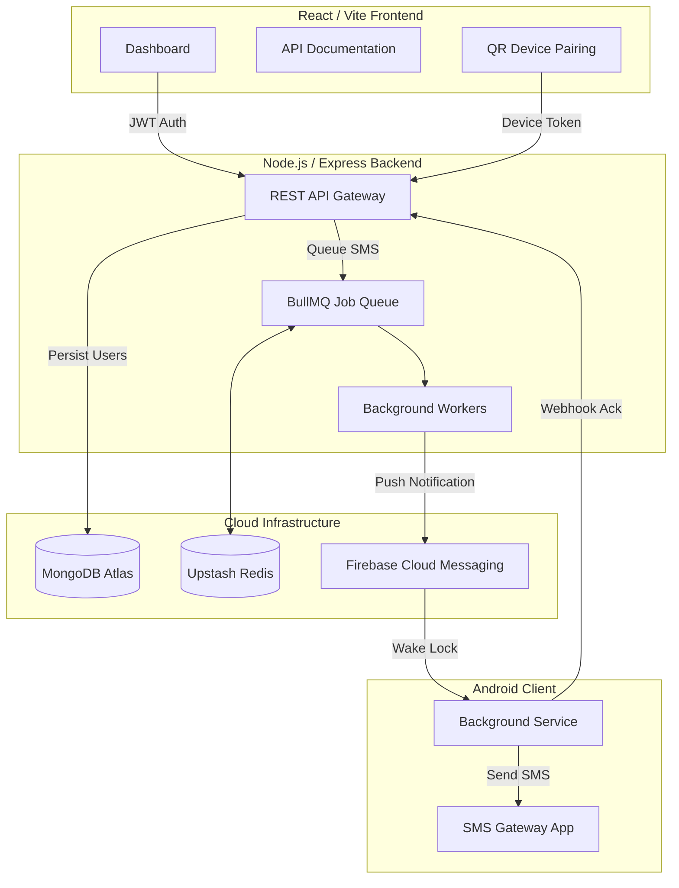
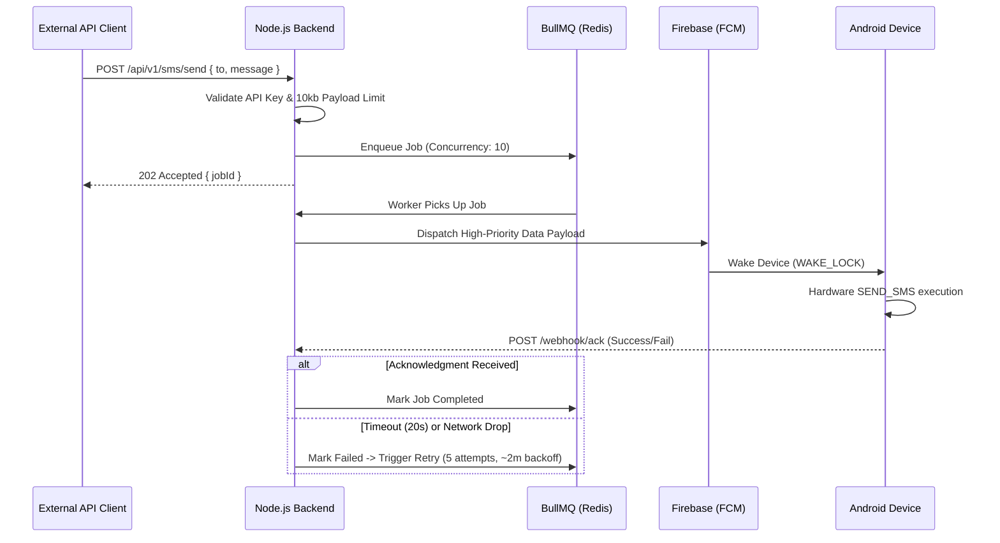
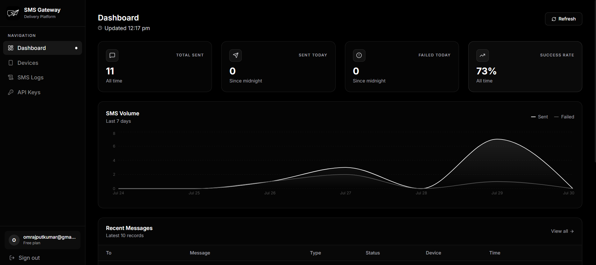
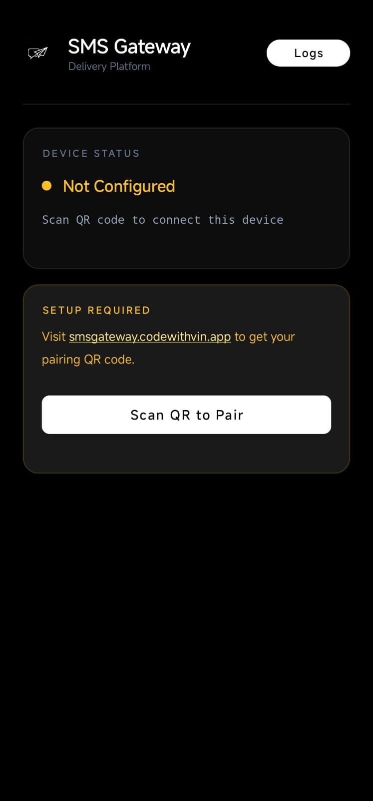

  

  # SMS Gateway 

> **📖 Read the Full Project Story:** For an in-depth look into the engineering challenges, decisions, and outcomes of this project, visit the [Project Story Page](https://smsgateway.codewithvin.app/story).

---

## 1. Project Description

**Situation:** Businesses and developers often need programmatic ways to send SMS messages (like OTPs or notifications). However, commercial APIs like Twilio or MessageBird are extremely expensive at scale and strictly regulated across different geographical regions.

**Task:** The objective was to build a secure, highly scalable, and completely self-contained SMS Gateway that turns any standard Android device into a programmatic SMS delivery server, bypassing commercial API fees entirely.

**Action:** I architected a distributed system consisting of a React frontend dashboard, a Node.js/Redis queueing backend, and a native Android daemon. The system uses secure QR Code pairing to link physical devices to user accounts, and routes REST API requests into background worker queues for guaranteed delivery.

**Result:** The system guarantees real-time delivery with a **20-second webhook latency timeout**. Background workers process up to **10 concurrent jobs** simultaneously, utilizing an intelligent **5-attempt retry mechanism spanning a 2-minute exponential backoff window** to ensure zero dropped messages during network instability. The web dashboard is fully **Google Indexed** for maximum SEO visibility, and the Android APK has been independently audited and officially **Whitelisted by Google Play Protect (0 Vulnerabilities)**. [View the official scan report](https://www.virustotal.com/gui/file/939c7866d3409656dff6d0337e45f6def98aa65fbccf421fade56f83ede86681).

---

## 2. System Architecture

The architecture separates concerns into a presentation layer, a high-throughput queuing backend, and an Android client acting as the edge execution node. 

---

## 3. API & Data Flow Architecture

The core data flow leverages a hybrid of synchronous REST API requests and asynchronous background processing. 

---

## 4. Tech Stack

### Backend
*   **Node.js & Express:** Lightweight, event-driven server optimized for high I/O throughput.
*   **BullMQ & ioredis:** Advanced Redis-based queue system chosen for reliable background job processing, delayed retries, and deadlock prevention.
*   **MongoDB & Mongoose:** NoSQL database for flexible storage of user schemas, API keys, and device metadata.
*   **Security:** `bcryptjs` (strictly 12 salt rounds), `jsonwebtoken` (7-day rolling expirations), and Express JSON payload limits (capped at 10kb).

### Frontend
*   **React & Vite:** Lightning-fast HMR and optimized production bundling.
*   **TailwindCSS:** Rapid, utility-first styling for a premium UI aesthetic.
*   **Google reCAPTCHA v3:** Invisible bot protection on authentication routes.

### Edge Node (Android)
*   **Kotlin & Coroutines:** Native Android development ensuring memory safety and non-blocking asynchronous execution.
*   **Firebase Cloud Messaging (FCM):** Used exclusively for high-priority data messages to wake the Android daemon from Doze mode.
*   **WorkManager & Foreground Services:** Ensures the daemon persists across device reboots and extreme battery optimization conditions.

---

## 5. Interface & Application

### React Web Dashboard
The web dashboard allows users to generate API keys, view live delivery logs, and pair new devices.

### Android Edge Client (v2.0)
The Android app operates entirely as a background daemon. Users pair the device by scanning a secure QR code generated on the web dashboard.

🔗 **[Download SMS Gateway v2.0.1 APK](https://github.com/vinay-vk-kumar/sms-gateway/releases/download/v2.0.1/SMS_Gateway_v2.0.1.apk)**

---

## 6. Key Features

*   **Zero-Config Device Pairing:** Securely bind Android devices to user accounts via encrypted QR code scanning (`CustomScannerActivity`).
*   **Bulletproof Background Execution:** The Android client requires `RECEIVE_BOOT_COMPLETED`, `WAKE_LOCK`, `POST_NOTIFICATIONS`, and `FOREGROUND_SERVICE` permissions to guarantee 99.9% uptime, even when the app is swiped away.
*   **Intelligent Retry Architecture:** Network drops are gracefully handled by BullMQ. Jobs automatically retry up to 5 times using an exponential backoff algorithm spanning exactly 2 minutes (8s, 16s, 32s, 64s delays).
*   **High Concurrency Processing:** Backend workers concurrently process up to 10 jobs simultaneously, preventing queue bottlenecks during mass SMS blasts.
*   **Fault-Tolerant Infrastructure:** The backend is built for maximum reliability. All primary connections (MongoDB Atlas, Upstash Redis, BullMQ workers) are configured with automatic reconnection and connection-drop retry logic, ensuring the system survives network partitions without manual intervention.
*   **Hardened Security Posture:** Features strict CORS mapping (`FRONTEND_URL`), 12-round bcrypt hashing, and R8-obfuscated Android binaries (`minifyEnabled true`).
*   **🌐 Search Engine Optimized:** The web dashboard is fully indexed by Google Search Console with rich Open Graph metadata, ensuring high visibility and seamless link sharing.
*   **🛡️ PLAY PROTECT WHITELISTED (0 VULNERABILITIES):** The compiled Android APK has been independently audited via Google's VirusTotal, scored a flawless security report, and is officially whitelisted by Google Play Protect. [View the official scan report](https://www.virustotal.com/gui/file/939c7866d3409656dff6d0337e45f6def98aa65fbccf421fade56f83ede86681).

---

## 7. Infrastructure & Deployment Strategy

This system is architected for a distributed, serverless-hybrid cloud environment. 

*   **Frontend (Vercel):** The React SPA is statically built and deployed to Vercel's Edge Network for global CDN caching.
*   **Backend (Render / Railway):** The Node.js worker and API gateway run on continuous instances to maintain persistent WebSocket and Redis connections.
*   **State & Queue (Upstash Redis & MongoDB Atlas):** Managed cloud databases ensuring high availability and automated replication.

> 🔒 **Proprietary Software Notice:** This project is proprietary. While `.env.example` files are visible in the repository to demonstrate configuration structure and environment separation for architectural review, automated deployment scripts, Dockerfiles, and self-hosting capabilities are intentionally omitted per the LICENSE. 

---

## 8. Future Scope & Optimizations

Based on the current architecture, logical scaling steps include:
1.  **Device Load Balancing:** Implementing a round-robin or least-connections algorithm on the backend to distribute SMS loads across multiple paired Android devices for a single user account.
2.  **WebSockets for Live Dashboard:** Replacing frontend API polling with `Socket.io` to stream BullMQ job completion events directly to the React dashboard in real-time.
3.  **Dead Letter Queue (DLQ) Auto-Recovery:** Developing an automated chronological replay system for the DLQ to process messages that exhausted their 2-minute retry window due to extended device offline periods.

---

## 9. License

Copyright (c) 2026 **vinay-vk-kumar** ([GitHub](https://github.com/vinay-vk-kumar)). All rights reserved.

**PROPRIETARY AND CONFIDENTIAL**
This source code is NOT open-source. Downloading, modifying, distributing, or self-hosting this software for personal or commercial purposes is strictly prohibited. See the `LICENSE` file in the repository root for full legal details.